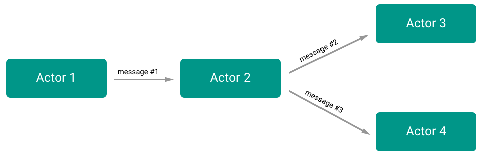
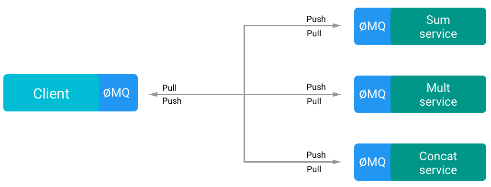

# Actor model

### Idea
The Actor model fits very well with Microservices system, since actors are stand-alone components that serve a single purpose and communicates each other by exchanging messages.

### Expectations
- All the communication are handled by the actors
- A service discovery layer is needed
- Actors work independently of each other

### Findings
An actor is a component of a system that receives messages and perform some operations based on the messages received.
The order of the messages is not important and a actor-based system does not impose a specific sequence of actions, since every actor works independently from each the others, and every actor does only one thing well.

The messages must be designed carefully, otherwise the risk of create a coupled system or worse, expose some internal representation is very high.

<p align="center">

<p align="center"><em>A flow example</em></p>
</p>

##### ZeroMQ
In this example has been used ZeroMQ.
ZeroMQ is a socket **library for messaging**, is multi-platform and is very fast, it can handle *8 million messages per second* with *30 micro-seconds latency*, and  it comes with multi-pattern solutions:
- Synchronous Request/Response
- Asynchronous Request/Response
- Publish/Subscribe
- Push/Pull
- Exclusive Pair

It is important to note that ZeroMQ *is not a message broker*, is a messaging library, if a message broker is needed, ZeroMQ provides its enterprise solution, [malamute](https://github.com/zeromq/malamute).  
ZeroMQ can use different transports methods, *tcp*, *inproc*, *ipc* and *pgm*.  
Depending of how well is structured the architecture of the application and the purpose of the single services, this approach will contrasts the *single point of failure*, making the system more **resilient**.

<p align="center">

<p align="center"><em>This example</em></p>
</p>

ZeroMQ enforces the concept of *"Smart endpoints, dumb pipelines"*, since it removes all the complexity and scalability problems that a standard message broker will have and it handles the messaging independently and locally in every service.  
ZeroMQ will handle network failures, queues, push and pull connections, it also handle the routing via *Round Robin* or *fair queuing* and forces the user to write a **message driven system**.

> The key in making great and growable systems is much more to design how its modules communicate rather than what their internal properties and behaviors should be.  
[Alan Key, father of OOP]

In this example all the communications are asynchronous and are made over a tcp connection, has been used the [*pipeline pattern*](http://zguide.zeromq.org/page:all#Divide-and-Conquer), but the ventilator and the sink are the same entity, the client. Since this approach is not a *request/response* pattern, every message has an unique id to be recognized by the caller.  
For the sake of simplicity the *service discovery* has not been resolved (yet).


## Usage
```bash
# Runs the client
$ npm start
# Runs all the services
$ npm run services
# Run single services
$ npm run sum
$ npm run mult
$ npm run concat
```
