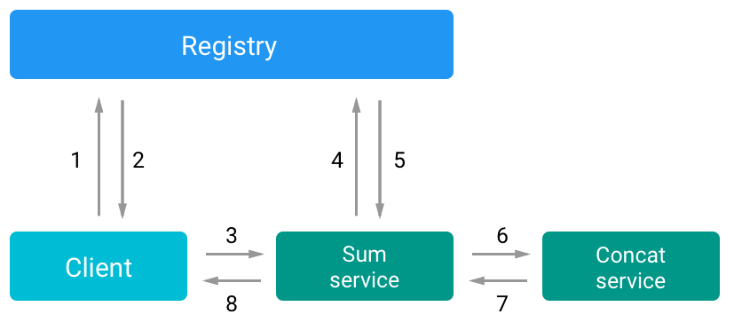

# Central registry

### Idea
Every microservice **does not know** where are the other and if they are alive, to solve this issue a solution can be use a **central registry**, a server that keeps in memory a list of all the services and their status. Every service on boot up must register itself to the central registry.

Every communication in this system is made via HTTP calls, using REST APIs.
It can be implemented also with RPC or other techniques.

### Expectations
- Very simple to implement
- Synchronous communication
- You can get the status of the entire system in a given time
- If the registry server is down, the entire infrastructure not works anymore.

### Findings
Use REST as communication pattern makes easy to implement services, because all the communication are **synchronous** and there's no need of an external infrastructure to send the messages.
REST gives a set of constraints that fits well in a microservice architecture, a *client-server approach, caching, stateless* and above all an *uniform interface*.
Every microservice easily declares its own routes and what expects on them.

REST downsides: every communication is **blocking**, and since a microservices architecture is distributed by definition, you cannot be sure that the network or the service you are calling are working.

Here we are building all our infrastructure over the *answer/response* REST pattern, and we are introducing a *coupling* between our services and network, so we need to implement a **failure strategy**.
What should do our services if something fails?

To prevent TCP connections timeouts or getting the same error constantly  we can introduce a **circuit breaker**, which is a system that must be queried every time that a service need another one, to find if the service is alive.

<p align="center">

<p align="center"><em>A flow example</em></p>
</p>

This kind of infrastructure is very easy to implement and it can give you the **state of the entire system** at any time, the cost of this, it that we are introducing a **single point of failure**.  
If the registry goes down it becomes impossible to use the system, because no one can get the other services address and status. As single point of failure, it creates a cascade of failures in every part of the system. In this way, the registry breaks one of the key features of a Microservices system, the **resilience**.

Furthermore if the registry uses an in-memory db, if it crashes it will "forget" all the registered services, and when the registry comes online again, the services list is empty even if all the services are up and running.  
This can be solved be reverse the process, every service pings the registry or by using a standard db (maybe Redis to get maximum performances).

## Usage
*You must run every service in a different terminal window, use postman or client.js to test the system.*
```bash
# Runs the registry
$ npm start
# Runs the services
$ npm run services
# Runs the client
$ npm run client
```
