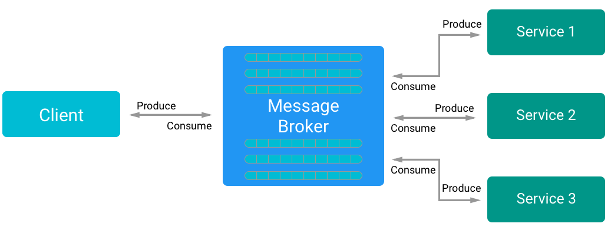
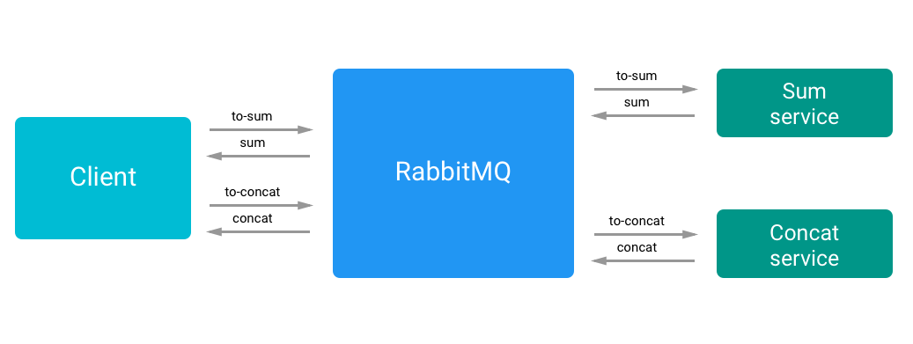
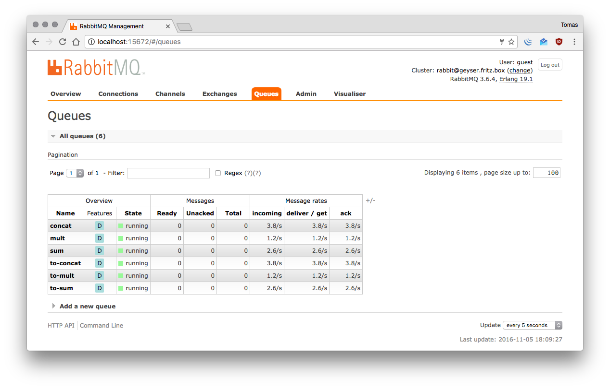

# Message broker

### Idea
When using a central registry and a request/response pattern, every service should know where are the other services and should manage the communication with them independently.
The idea of the Message broker is the opposite, every service should only know where is (in the network) the Broker and all the communication between the services are handled by the Message broker.

### Expectations
- All the communication complexity is handled by the broker
- The broker can become a bottleneck
- The broker will handle error when trying to deliver messages
- The broker is a single point of failure

### Findings
The main advantage of the *message broker*, compared to the *Central registry* pattern, is that the services do not need to know where are the others, they assume that somewhere there's a service or a client that is consuming their messages.
In this way a service must only know where is the Message Broker in the network and communicate with him.
There are different communication patterns, commonly is used a tcp socket and every microservice subscribe itself to a queue in the broker.

<p align="center">

<p align="center"><em>A flow example</em></p>
</p>

The message broker is a service that will handle message validation, transformation and routing of every message in the system. It enforces a **decoupling** of the system minimizing the mutual awareness that the services should have of each other.

#### RabbitMQ
RabbitMQ is a message-oriented middleware that implements the *Advanced Message Queuing Protocol* (AMQP), RabbitMQ is wrote in *Erlang* and is based on the *Open Telecom Platform* (OTP) to handle the clustering and failover.

Is focused on Reliability, flexible routing, clustering, highly available queue is also multi protocol and offers a tracing system. Is extensible with custom plugins.

Keywords:
- **producer**: the application that sends messages
- **consumer**: the application that receives messages
- **queue**: a buffer that stores the messages

The connection is done over TCP using the AMQP protocol.
The messages are not directly published in a queue, the producers send their messages to an exchange, that is a messaging routing agent defined by RabbitMQ. The exchange is responsible for the routing of the various messages in the queues, it also handles attributes, bindings and routing keys.

The typical message flow in RabbitMQ is:

1. The producer publish a message to the exchange
2. the exchange receive the message and route it into the correct queue
3. the message stays in the queue until is consumed by a consumer
4. when a messages has been consumed is removed from the queue following the previously chosen strategy.

<p align="center">

<p align="center"><em>A flow example</em></p>
</p>

#### How is composed a message:
```javascript
{
  fields: {
    consumerTag: ...,
    deliveryTag: ...,
    redelivered: ...,
    exchange: ...,
    routingKey: ...
  },
  properties: {
    contentType: ...,
    contentEncoding: ...,
    headers: {},
    deliveryMode: ...,
    priority: ...,
    correlationId: ...,
    replyTo: ...,
    expiration: ...,
    messageId: ...,
    timestamp: ...,
    type: ...,
    userId: ...,
    appId: ...,
    clusterId: ...
  },
  content: Buffer [ ... ]
}
```

RabbitMQ is a strong and scalable message broker, and enforces the decoupling of the system, it resolves the service discovery problem since every service knows where find the broker (or they just ping a DNS service).  
In addition RabbitMQ guarantee that a message has been received and offers a useful *management interface*, that you can reach on http://localhost:15672/ (if you are running RabbitMQ in localhost), the user and password for a fresh install are both `'guest'`.

<p align="center">

<p align="center"><em>A screen of the management interface</em></p>
</p>

## Usage
You will need RabbitMQ installed on your machine to run this example, if you are on macOS, just use `brew install rabbitmq`.
```bash
# Run Redis
$ npm run rabbitmq
# Runs the client
$ npm start
# Runs all the services
$ npm run services
# Run single services
$ npm run sum
$ npm run mult
$ npm run concat
```
