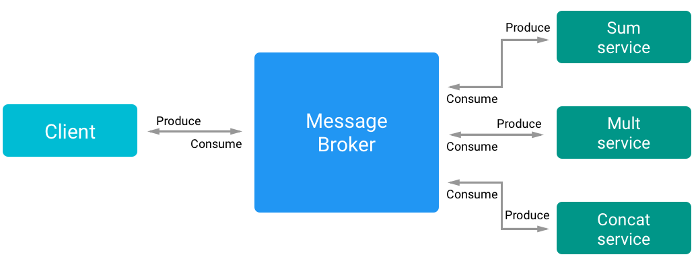
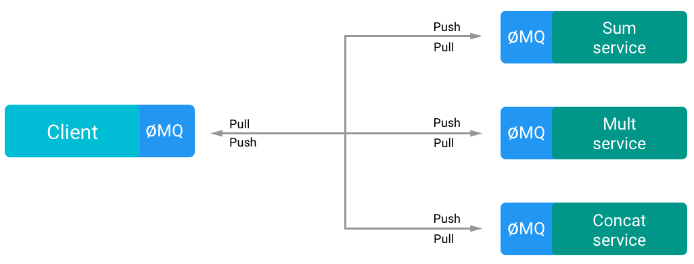

# Message Queue

### Idea
When using a central registry and a request/response pattern, every service should know where are the other services and should manage the communication with them independently.
The idea of the Message broker is the opposite, every service should only know where is (in the network) the Broker and all the communication between the services are handled by the Message broker.

### Expectations
- All the communication complexity is handled by the broker
- The broker can become a bottleneck
- The broker will handle error when trying to deliver messages
- The broker is a single point of failure

### Findings
The main advantage of the *message broker*, compared to the *Central registry* pattern, is that the services do not need to know where are the others, they assume that somewhere there's a service or a client that is consuming their messages.
In this way a service must only know where is the Message Broker in the network and communicate with him.
There are different communication patterns, commonly is used a tcp socket and every microservice subscribe itself to a queue in the broker.

<p align="center">

<p align="center"><em>A flow example</em></p>
</p>

The message broker is a service that will handle message validation, transformation and routing of every message in the system. It enforces a **decoupling** of the system minimizing the mutual awareness that the services should have of each other.

##### ZeroMQ
In this example has been used ZeroMQ.
ZeroMQ is a socket **library for messaging**, is multi-platform and is very fast, it can handle *8 million messages per second* with *30 micro-seconds latency*, and  it comes with multi-pattern solutions:
- Synchronous Request/Response
- Asynchronous Request/Response
- Publish/Subscribe
- Push/Pull
- Exclusive Pair

It is important to note that ZeroMQ *is not a message broker*, is a messaging library, if a message broker is needed, ZeroMQ provides its enterprise solution, [malamute](https://github.com/zeromq/malamute).  
ZeroMQ can use different transports methods, *tcp*, *inproc*, *ipc* and *pgm*.  
Depending of how well is structured the architecture of the application and the purpose of the single services, this approach will contrasts the *single point of failure*, making the system more **resilient**.

<p align="center">

<p align="center"><em>A flow example</em></p>
</p>

ZeroMQ enforces the concept of *"Smart endpoints, dumb pipelines"*, since it removes all the complexity and scalability problems that a standard message broker will have and it handles the messaging independently and locally in every service.  
ZeroMQ will handle network failures, queues, push and pull connections, it also handle the routing via *Round Robin* or *fair queuing* and forces the user to write a **message driven system**.

> The key in making great and growable systems is much more to design how its modules communicate rather than what their internal properties and behaviors should be.  
[Alan Key, father of OOP]

In this example all the communications are asynchronous and are made over a tcp connection, has been used the [*pipeline pattern*](http://zguide.zeromq.org/page:all#Divide-and-Conquer), but the ventilator and the sink are the same entity, the client. Since this approach is not a *request/response* pattern, every message has an unique id to be recognized by the caller.  
For the sake of simplicity the *service discovery* has not been resolved (yet).


## Usage
```bash
# Runs the client
$ npm start
# Runs all the services
$ npm run services
# Run single services
$ npm run sum
$ npm run mult
$ npm run concat
```
