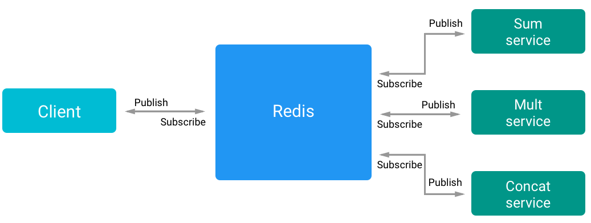
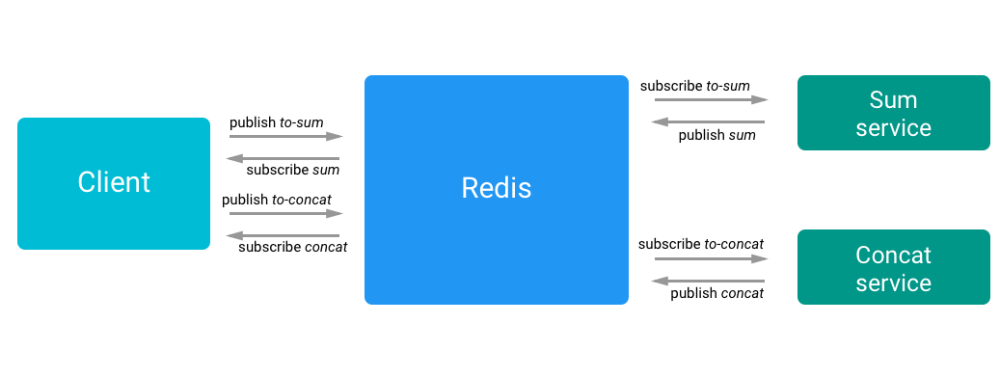
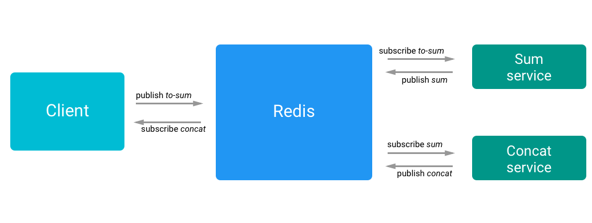

# Pub-Sub

### Idea
As seen with the *Message Queue pattern*, in a *Pub/Sub* system all the communication complexity is handled by the Message Broker. In this case every service subscribe itself to a event and the Message Broker will notify them with a previously defined communication pattern if an event has just happened.
The event management will be handled by *Redis* a NoSQL key-value data store with a Pub/Sub server.

### Expectations
- All the communication complexity is handled by the broker
- Redis can become a bottleneck
- Redis is a single point of failure

### Findings
The main difference between a message queue system and a pub/sub system is how are managed the messages/events inside the broker.

In a message queue system (usually) if more than one service want to consume the message from the same queue, the broker will send the messages using a *round robin* or *fair queuing* pattern, furthermore, if the receiver is not reachable, the broker will retry the sending and in most cases the contents of a queue persist until they are consumed by a consumer process.

In contrast a pub/sub system, has not the concept of queues, is has channels, where publishers send their events and the server will handle the emit.
Pub/sub channels tends to be *ephemeral*, this means that if there are not subscribers to a given channel, the content will be discarded.

##### Redis

In this example has been used Redis, that as says above come with a native pub/sub system.  
There are different patterns of how the broker sends the event to the subscribers, every subscriber can *pull* to fetch events from the broker to find if there are new events or the broker can *push* the new events to the subscribed clients, that is the case of Redis.
All the subscribers of an event gets the message and if a subscriber goes down for a while it will no get the past events.

<p align="center">

<p align="center"><em>A flow example</em></p>
</p>

Obviously this approach introduces a **single point of failure**, but can this problem can be managed by using an *high availability* infrastructure.
One of the most useful parts when using a centralized pub/sub server, is that we don't need service discovery, every service knows where is the broker and the ip resolution will be handled by a DNS server.  

<p align="center">

<p align="center"><em>How this example has been implemented</em></p>
</p>

Using this approach we can guarantee the **decoupling** of publishers and subscribers allowing a greater **scalability** and a dynamic network topology.

<p align="center">

<p align="center"><em>Another implementation of how this example can be built</em></p>
</p>

Downsides of the pub/sub pattern:
- Incomplete subscriber list
- Fast publisher, slow subscriber
- Message order

##### Incomplete subscriber list:
As said above, a channel if ephemeral, this means that there is not retain of old events, so if a subscriber boot up late for some reason it will probably miss some events.  
A solution could be save for a certain amount of time the emitted events inside the broker or set a specific memory limit (say, 1KB) of memorized events.

##### Fast publisher, slow subscriber:
pub/sub is a *push* technology, this means that a very active publisher can overload a slow subscriber.  
A solution can be use an intermediate service that handles the events overload helping the final subscriber or the publisher and the subscriber can negotiate a set of constraints, this a good solution but it cost extra work to make the infrastructure working.

##### Message order:
The publisher maintains the message order, but the subscriber for some reasons that not depends on him cannot guarantee the message order.  
A solution can use a delivery receipt, if a subscriber does not emit a receipt the publisher know that something went wrong.

## Usage
You will need Redis installed on your machine to run this example, in you are on macOS, just use `brew install redis`.
```bash
# Run Redis
$ npm run redis
# Runs the client
$ npm start
# Runs all the services
$ npm run services
# Run single services
$ npm run sum
$ npm run mult
$ npm run concat
```
