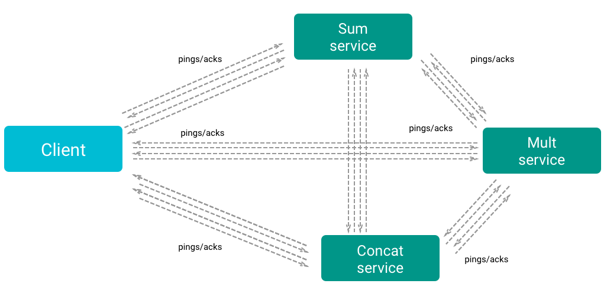
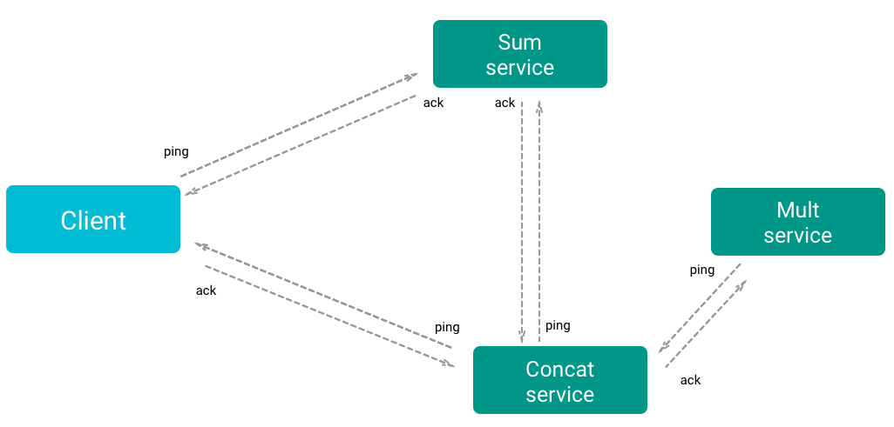
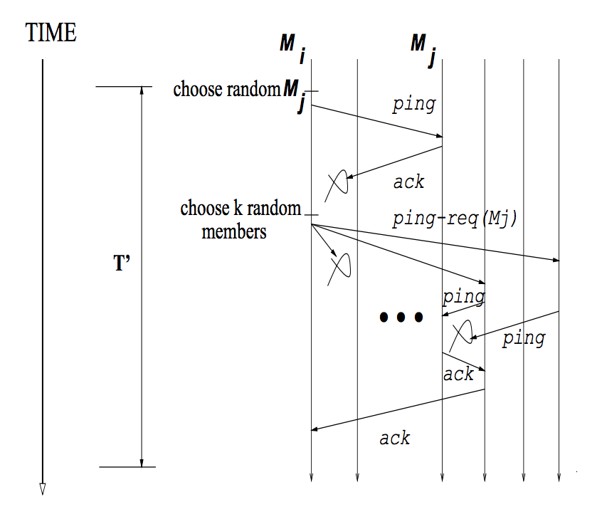
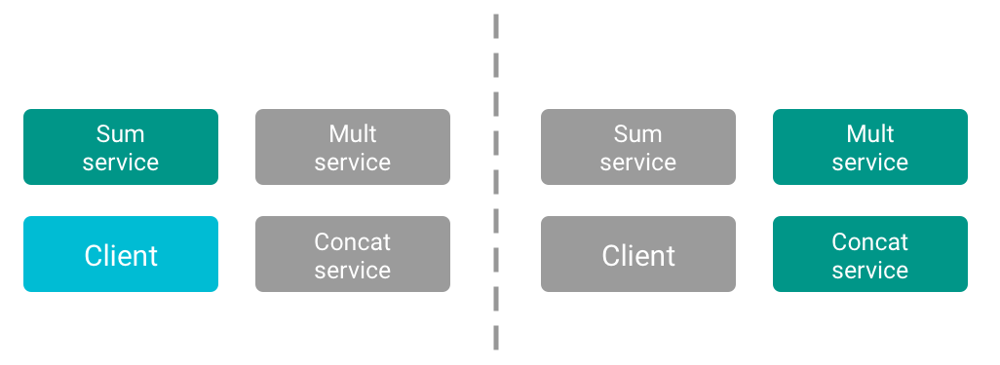

# Service Discovery

### Idea
One of the biggest problems in a distributed architecture is *service discovery*. A easy and typical solution is use a central registry, who pings all the services to find if they are alive. Another solution is use a centralized system to exchange messages, every component of the system connect itself to the central broker and starts to communicate with other services.

All this solutions has one big common problem, they are a **single point of failure**. If the centralized system stops working, the entire infrastructure will not work anymore.
Hence the need of a distributed system to achieve the service discovery.

### Expectations
- Hard to implement
- Need of a DNS system to find other services
- Failure detection
- Resilient system

### Findings
An easy solution to achieve a decentralized service discovery and failure detection is that every service of the system, pings all the others to find if they are alive.  
It is a good solution if your requirements are *strong completeness* and *fast failure detection*, but is not *scalable*.
If we are heart-beating our entire system every a given amount of time (say, one second) we are generating a big number of messages every second, and the complexity of this approach, is **N squared**.

<p align="center">

<p align="center"><em>Heart-beating example</em></p>
</p>

Just to give an example, if we have a system composed by 5 services, every second we are sending 25 messages over the network, but if we have a system composed by 100 services, we are sending 10000 messages every second over the network.

A way better solution is to use a **Gossip-based Membership Protocol**.
> A gossip protocol is a style of computer-to-computer communication protocol inspired by the form of gossip seen in social networks. Modern distributed systems often use gossip protocols to solve problems that might be difficult to solve in other ways, either because the underlying network has an inconvenient structure, is extremely large, or because gossip solutions are the most efficient ones available. [Wikipedia]

A membership protocol provides each process of the group with a locally maintained list, called a membership list, of other non-faulty processes in the group.

#### SWIM

One of the best implementation of this approach was achieved by some researchers of the *Cornell University*, presented in their white paper:
**SWIM: Scalable Weakly-consistent Infection-style Process Group Membership
Protocol**.

*SWIM* handles both situations where a given node is the first node of a new cluster and the situation where a new node is added to an existing cluster.
In the second situation the new node will do a full state sync with other existing members of the cluster over TCP and then it will begin gossip its existence to the cluster.

The gossip is done over UDP with a configurable but fixed fan-out and interval, this will ensure a constant network usage regardless of the number of nodes.

<p align="center">

<p align="center"><em>SWIM example</em></p>
</p>

When a Node gets a ping request it responds with an *Ack*, and if it doesn't after some time (usually a multiple of *RTT*) the node that made the ping request asks to a configurable number of random nodes to try ping the suspected-dead node to find if is a network problem or the node is actually down.  
If no one can reach the node, it is marked as suspicious but is still a member of the cluster. After a reasonable period of time if the suspected node does not dispute the suspicion, it will be considered dead, and his state will be gossiped to the entire cluster.

The main difference between *SWIM* and other heart-beating/gossip protocols is how *SWIM* uses other targets to reach a suspicious so as to avoid any congestion on the network path between the current node and the suspicious one.

<p align="center">

<p align="center"><em>Failure detection from the white paper</em></p>
</p>

*SWIM* has been tested both in small and large networks and it was found that it has a **constant load** on the network and a **constant time to failure detection**, a **low false positive rate** and a **logarithmic increase of latency**.

##### Limitations

As its definition says, *SWIM* is weakly consistent, this means that a given two nodes at a given time, the network topology can be different, but for how is designed the protocol, the *convergence* to a consistent network map happens quickly.

An hard problem to solve is the "network partition":

<p align="center">

<p align="center"><em>Network partition example</em></p>
</p>

If the network is divided into two or more part, the nodes in every part will try to redesign the network map, and in every partition there will be a different topology.
A solution of the network partition is to not delete the dead-nodes from the nodes list and periodically attempt to reconnect to them and define a strategy to merge the two sub-networks.

#### This example

In this example has been used *SWIM* to handle the membership and failure detection, a local DNS discovery service to allow a service to find the others and *ZeroMQ* as communication layer.

Every service is designed to act as is alone in the world, on bootup it searches for other services in the (local) network and after 500 milliseconds if it does not find other services it starts the *SWIM* protocol with no other members in the network.
If instead it finds other services in the network, it will join the other node, using the above explained mechanism.

If you want more information of how *ZeroMQ* works, see the [message-queue](https://github.com/delvedor/Microservices/tree/master/message-queue) example.  
If you want more information about *SWIM* [this](http://www.cs.cornell.edu/~asdas/research/dsn02-SWIM.pdf) is the white paper.


## Usage
```bash
# Run the client
$ npm start
# Run single services
$ npm run sum
$ npm run mult
$ npm run concat
```
